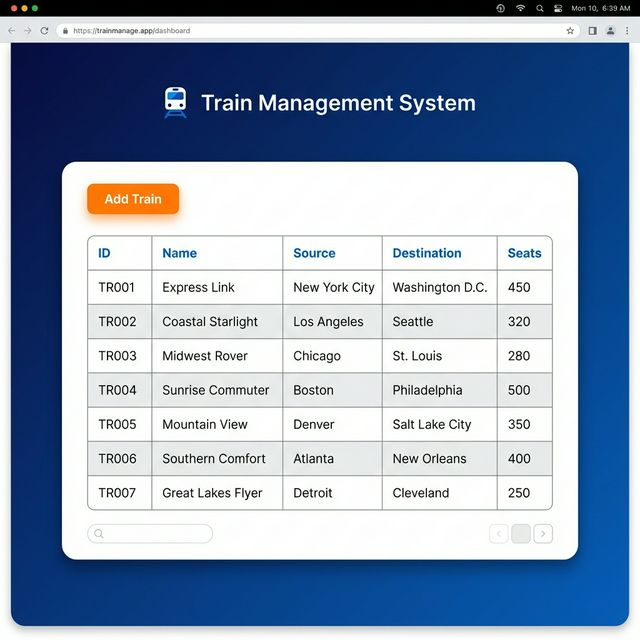
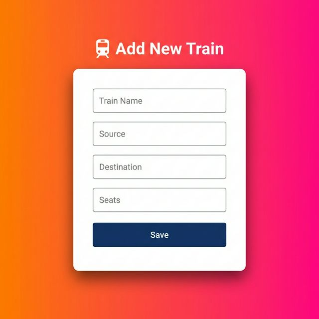

# 🚆 Train Management System (TrackIt)

A robust and responsive web application built with **Spring Boot** and **Thymeleaf**, designed to streamline the process of managing train schedules and inventory.

## 🌟 Features

- **Dashboard View**: View a clear, tabulated list of all available trains, complete with ID, train name, source, destination, and seat availability.
- **Add New Trains**: A user-friendly form interface allowing administrators to easily insert new train routes and capacities into the database.
- **Modern UI**: Clean and vibrant UI design with CSS gradients, responsive containers, and interactive elements.
- **Database Integration**: Powered by Spring Data JPA and MySQL for reliable data persistence.

## 📸 Screenshots

### Home Dashboard
The main dashboard where you can see all the listed trains.



### Add Train Form
The interface for inputting new train details.



## 🛠️ Technology Stack

- **Backend:** Java, Spring Boot, Spring Data JPA
- **Frontend:** HTML5, CSS3, Thymeleaf (Server-side rendering)
- **Database:** MySQL
- **Build Tool:** Maven

## 🚀 Getting Started

### Prerequisites
- JDK 17 or higher
- Maven 3.6+
- MySQL Server

### Database Setup
1. Create a MySQL database named `train`:
   ```sql
   CREATE DATABASE train;
   ```
2. Update the `src/main/resources/application.properties` with your MySQL credentials:
   ```properties
   spring.datasource.url=jdbc:mysql://localhost:3306/train
   spring.datasource.username=root
   spring.datasource.password=your_password
   ```

### Running the Application
To run the application locally, use the Maven wrapper included in the project:

```bash
./mvnw spring-boot:run
```

The application will start on `http://localhost:8081`.

## 🤝 Contributing

Contributions, issues, and feature requests are welcome! Feel free to check the issues page.
